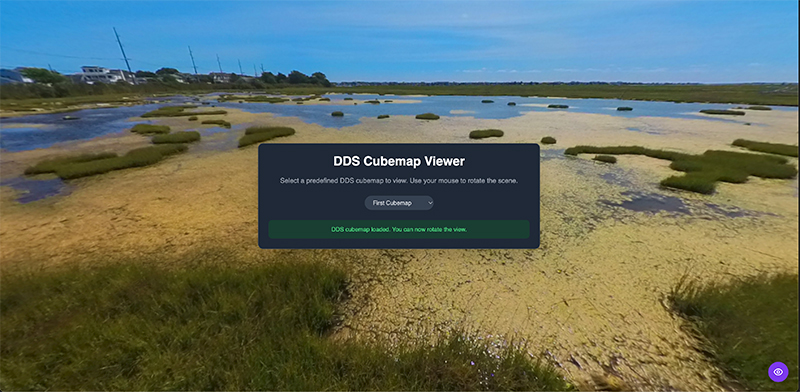

### Spherical Tools for Spherical Cameras

This small repos contains utilities and web related files that I have created for processing and sharing my 360 degree still and video imagery on the web.  Feel free to make comments and suggestions on this repo, but the main reason I'm putting this out there is because others may find this small growing collection useful.  I currently have many ongoing projects and may take some time to get back to you.

The "utility" folder contains the "image_to_cubemap" C++ code which can turn an equirectangular DNG or JPG from spherical cameras (e.g., an Insta360 X5) and produce a .DDS cubemap image in the same folder (as well as a PNG).  The cubemap files can then be displayed on the web using the files in the "www" subfolder.  Many games can also load DDS cubemaps as skyboxes.  Change the contents of the "cubemaps.txt" file in the 'www' folder to specify what to name each cubemap, and where the converted DDS files are stored so they can be loaded in your browser's page.  This is done mostly via Javascript using three.js and some custom DDS loading code.

Here's a quick example.  If you have a raw equirectangular image as a cubemap_one.dng like:


Then you can then build the "image_to_cubemap" utility in Linux or MacOS (using brew) by using CMake.  You must have Qt6 (image editing and saving) and libraw (to read DNG files) libraries install which are easily available on MacOS (brew) and Linux.  You can compile the utility like this:

```
cd utility
mkdir build
cd build
cmake ..
make
```

If you place the source DNG file in the utility/build folder, you can run the utility:


./image_to_cubemap ./cubemap_one.dng


This will create a cubemap_one.png and cubemap_one.dds in the same folder.  The output may look something like:


```
Extension: 'dng'
DDS: '../cubemap_one.dds'
PNG: '../cubemap_test1.png'
Edge length in pixels: 1488
Output image dimensions: 5952x4464
Processing 0 of 5952
Processing 1000 of 5952
Processing 2000 of 5952
Processing 3000 of 5952
Processing 4000 of 5952
Processing 5000 of 5952
Saving Cubemap to PNG: ../cubemap_one.png
Saved Cubemap to PNG: ../cubemap_one.png
Saved Cubemap to DDS: ../cubemap_one.dds
```

You should now have a cubemap_one.png that looks something like this:


The DDS file is harder to see and is more like a stack of six images in image editors.   To see this cubemap in the browser, edit the cubemaps.txt file in the /www folder and add an entry like:

My First Cubemap=cubemaps/cubemap_one.dds

Then put the cubemap_one.dds from the utility/build folder in the www/cubemaps folder.  You can start a test server using the 'start_http_server' script in the 'www' folder.  Then point your browser at:

http://localhost:8080/index.html

You should see your cubemap come up.  it should look something like:



You can use the mouse to spin the view around.  There is also a symbol in the bottom right of the page which will show the controls so you can pick a different cubemap from your selection in the cubemaps.txt file.  The controls do come up for a split second when the page first comes up, but I have the HTML automatically select the first cubemap which causes the controls to slowly hide until the button is pressed.
